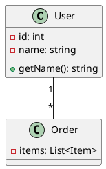
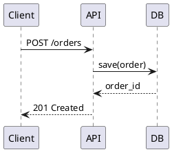
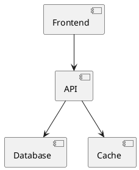
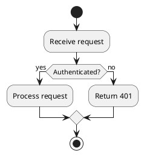

# UML Generation
## When to Use
- Code analysis, architecture documentation
- Reverse-engineering existing systems
- Communication with stakeholders

## Diagram Types
### Class Diagram

### Sequence Diagram

### Component Diagram

### Activity Diagram

## PlantUML Syntax Reference
### Relationships
| Symbol | Meaning |
|--------|---------|
| `-->` | Dependency |
| `--` | Association |
| `o--` | Aggregation |
| `*--` | Composition |
| `<|--` | Inheritance |
| `..|>` | Implementation |

### Visibility
| Symbol | Meaning |
|--------|---------|
| `+` | Public |
| `-` | Private |
| `#` | Protected |
| `~` | Package |

## Workflow
1. Analyze source code structure
2. Identify key classes/components
3. Map relationships
4. Generate PlantUML syntax
5. Render diagram

## Output
Provide complete PlantUML code that can be rendered at:
- plantuml.com
- VS Code PlantUML extension
- Local PlantUML installation
