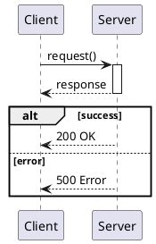
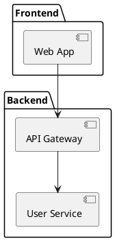

# UML Generation Skill
**Version:** v0.18.0

## Purpose
Analyze source code and generate UML diagrams with PlantUML syntax and online rendering URLs.

## When to Invoke
- Code analysis requiring visual documentation
- Architecture review and documentation
- Reverse-engineering existing codebases
- Understanding class hierarchies
- Documenting API call flows
- Technical debt visualization (with anti-pattern-analysis)

## Supported Diagrams
| Diagram | Use Case | Priority |
|---------|----------|----------|
| **Class** | Code structure, inheritance | High |
| **Sequence** | Method flows, API interactions | High |
| **Component** | Architecture, module dependencies | Medium |
| **Activity** | Workflow logic, algorithms | Medium |
| **State** | State machines, lifecycle | Low |

## Output Format
Each diagram includes:
1. **PlantUML Source** - Copyable syntax
2. **Online URL** - `http://www.plantuml.com/plantuml/svg/[encoded]`
3. **Download Links** - SVG and PNG variants

## PlantUML Quick Reference

### Class Diagram
```plantuml
@startuml
class ClassName {
  +publicField: Type
  -privateField: Type
  +publicMethod(): ReturnType
}
ClassA <|-- ClassB        ' inheritance
ClassA <|.. ClassB        ' implementation
ClassA *-- ClassB         ' composition
ClassA --> ClassB         ' association
ClassA "1" --> "*" ClassB ' multiplicity
@enduml
```

### Sequence Diagram


### Component Diagram


## URL Encoding
1. UTF-8 encode source
2. Deflate compress
3. Base64-like encode (PlantUML alphabet)
4. Construct: `http://www.plantuml.com/plantuml/svg/{encoded}`

**Limit:** ~2000 chars (browser limit). For larger diagrams, output source only.

## Integration Points
| Integration | Use |
|-------------|-----|
| extract-prd | Visual architecture in PRD extraction |
| anti-pattern-analysis | Visualize problematic classes |
| Backend-Specialist | Service layer diagrams |
| API-Integration | Sequence diagrams for flows |

## Limitations (Phase 1)
- Internet required for rendering
- URL length ~2000 chars
- Code visible to public PlantUML server
- No caching

---

**End of Skill Document**
