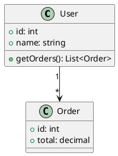

# UML Generation Skill

---
name: uml-generation
version: v0.14.0
description: Generate UML diagrams from source code using PlantUML
---

## When to Invoke
- Code analysis requiring visual documentation
- Architecture review and documentation
- Reverse-engineering existing codebases
- Understanding class hierarchies
- Documenting API call flows

## Supported Diagram Types
| Diagram | Use Case | Priority |
|---------|----------|----------|
| Class Diagram | Code structure, inheritance | High |
| Sequence Diagram | Method call flows, API interactions | High |
| Component Diagram | Architecture, dependencies | Medium |
| Activity Diagram | Workflow logic | Medium |
| State Diagram | State machines | Low |

## What Gets Extracted

**Class Diagrams:** Classes, interfaces, inheritance, associations, visibility, methods, properties
**Sequence Diagrams:** Method call chains, request/response, async operations
**Component Diagrams:** Module structure, dependencies, interfaces

## Output Format
1. PlantUML source (copyable)
2. Rendering URL (plantuml.com)
3. Brief description

## Example Output

Render: `http://www.plantuml.com/plantuml/png/[encoded]`
