# Class Diagram Guide
**Version:** v0.17.0

PlantUML syntax reference for generating class diagrams from source code.

---

## Basic Class Definition

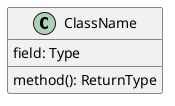

---

## Visibility Modifiers

| Symbol | Visibility | Example |
|--------|------------|---------|
| `+` | Public | `+name: string` |
| `-` | Private | `-password: string` |
| `#` | Protected | `#internalId: int` |
| `~` | Package/Internal | `~helper: Helper` |

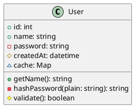

---

## Field and Method Modifiers

### Static Members
Use `{static}` or underline:

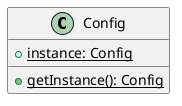

### Abstract Members
Use `{abstract}` or italics:

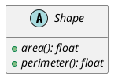

---

## Class Types

### Regular Class
```plantuml
class RegularClass {
}
```

### Abstract Class
```plantuml
abstract class AbstractClass {
}
```

### Interface
```plantuml
interface InterfaceName {
}
```

### Enum
```plantuml
enum Status {
  PENDING
  ACTIVE
  COMPLETED
  CANCELLED
}
```

### Annotation (Stereotype)
```plantuml
class Service <<service>> {
}

class Entity <<entity>> {
}
```

---

## Relationships

### Inheritance (extends)

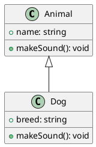

**Arrow:** `<|--` (empty triangle pointing to parent)

### Implementation (implements)

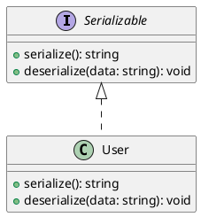

**Arrow:** `<|..` (dashed, empty triangle)

### Association

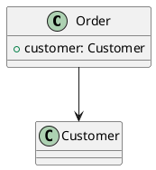

**Arrow:** `-->` (simple arrow)

### Aggregation (has-a, weak)

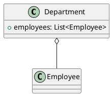

**Arrow:** `o--` (empty diamond)

Parts can exist independently of the whole.

### Composition (has-a, strong)

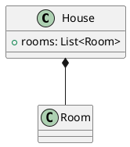

**Arrow:** `*--` (filled diamond)

Parts cannot exist without the whole.

### Dependency

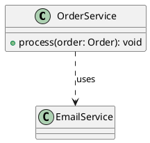

**Arrow:** `..>` (dashed arrow)

---

## Multiplicity

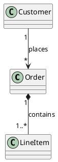

| Notation | Meaning |
|----------|---------|
| `1` | Exactly one |
| `*` | Zero or more |
| `0..1` | Zero or one |
| `1..*` | One or more |
| `n..m` | Between n and m |

---

## Labels and Notes

### Relationship Labels

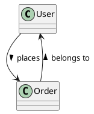

### Notes

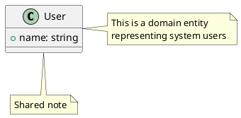

---

## Packages and Namespaces

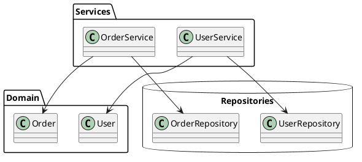

---

## Generics

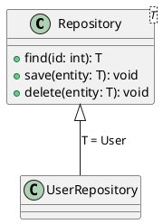

---

## Complete Example

```plantuml
@startuml
skinparam classAttributeIconSize 0

package "Domain" {
  abstract class Entity {
    #id: UUID
    #createdAt: datetime
    #updatedAt: datetime
  }

  class User {
    +email: string
    -passwordHash: string
    +name: string
    +role: UserRole
    --
    +authenticate(password: string): boolean
    +changePassword(old: string, new: string): void
  }

  class Order {
    +orderNumber: string
    +status: OrderStatus
    +total: decimal
    --
    +addItem(product: Product, qty: int): void
    +removeItem(lineItem: LineItem): void
    +calculateTotal(): decimal
  }

  class LineItem {
    +quantity: int
    +unitPrice: decimal
    +subtotal: decimal
  }

  class Product {
    +sku: string
    +name: string
    +price: decimal
  }

  enum UserRole {
    ADMIN
    CUSTOMER
    GUEST
  }

  enum OrderStatus {
    PENDING
    CONFIRMED
    SHIPPED
    DELIVERED
    CANCELLED
  }
}

Entity <|-- User
Entity <|-- Order
Entity <|-- Product

User "1" --> "*" Order : places
Order "1" *-- "1..*" LineItem : contains
LineItem "*" --> "1" Product : references
User --> UserRole
Order --> OrderStatus
@enduml
```

---

## Styling Tips

### Hide Empty Members
```plantuml
hide empty members
```

### Hide Specific Elements
```plantuml
hide class circle
hide interface circle
hide enum circle
```

### Monochrome
```plantuml
skinparam monochrome true
```

### Direction
```plantuml
left to right direction
' or
top to bottom direction
```

---

## Extraction Patterns

### From Source Code

When analyzing code, extract:

1. **Classes**: All class/interface/enum definitions
2. **Fields**: Instance and static variables with types
3. **Methods**: Signatures with parameters and return types
4. **Relationships**:
   - Inheritance from `extends`/`:` keywords
   - Implementation from `implements`/`:` keywords
   - Associations from field types
   - Dependencies from method parameters and local variables

### Filtering

For large codebases, focus diagrams on:
- Single package/module at a time
- Specific feature or domain
- Public API only (hide private members)
- Key relationships only (hide weak dependencies)

---

**End of Class Diagram Guide**
