# Component Diagram Guide
**Version:** v2.16.1

PlantUML syntax reference for generating component and architecture diagrams from source code.

---

## Basic Component

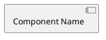

Or with explicit keyword:


---

## Component Types

### Standard Component

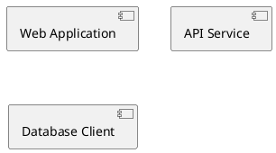

### With Stereotypes

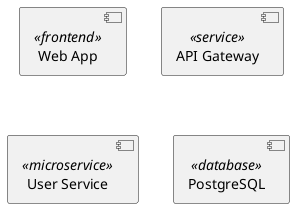

---

## Interfaces

### Provided Interface (Lollipop)

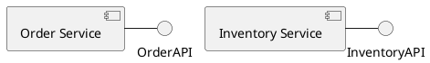

### Required Interface (Socket)

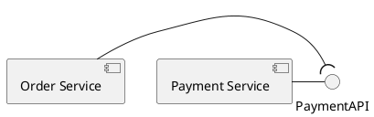

### Named Interface

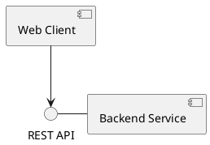

---

## Packages and Layers

### Basic Package

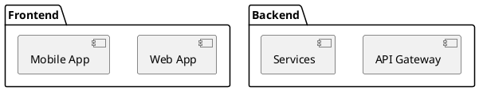

### Package Styles

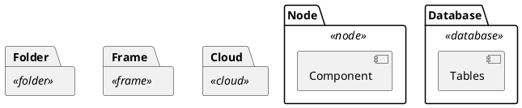

### Nested Packages

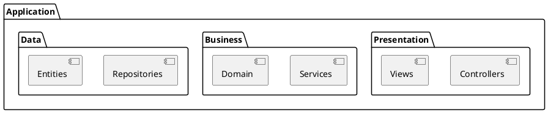

---

## Relationships

### Dependency

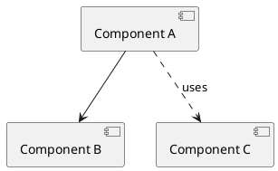

### Directional Dependencies

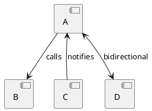

### Arrow Styles

| Arrow | Meaning |
|-------|---------|
| `-->` | Dependency (solid) |
| `..>` | Dependency (dashed) |
| `--` | Association |
| `..` | Association (dashed) |

---

## Ports

```plantuml
@startuml
component [Web Server] {
  port HTTP
  port HTTPS
}

[Client] --> HTTP
[Secure Client] --> HTTPS
@enduml
```

---

## Database and Storage

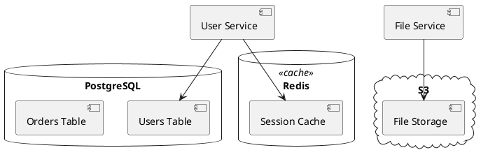

---

## Actors and External Systems

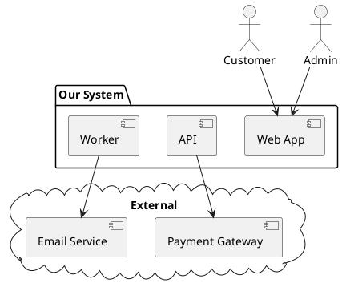

---

## Complete Example: Microservices Architecture

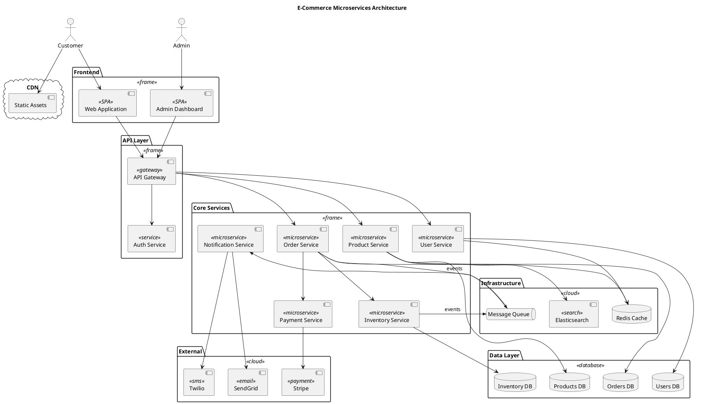

---

## Layered Architecture Example

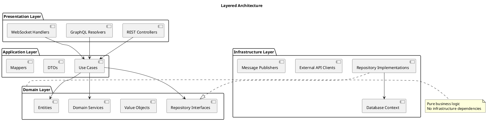

---

## Extraction Patterns

### From Directory Structure

```
src/
├── api/           → [API Layer] package
│   ├── controllers/ → [Controllers] component
│   └── middleware/  → [Middleware] component
├── services/      → [Services] package
│   ├── user/      → [User Service] component
│   └── order/     → [Order Service] component
├── repositories/  → [Data Access] package
└── models/        → [Domain] package
```

### From Import/Dependency Analysis

1. Scan import statements in each file
2. Group files by directory/module
3. Map imports to component dependencies
4. Identify external package dependencies

### Focus Areas

For large systems, create separate diagrams for:
- High-level system overview
- Single bounded context/domain
- Deployment view (nodes, containers)
- Data flow view
- Integration points only

---

## Styling

### Colors

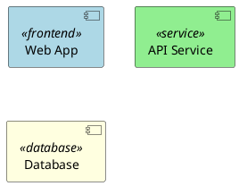

### Direction

```plantuml
@startuml
left to right direction
[A] --> [B] --> [C]
@enduml
```

### Monochrome

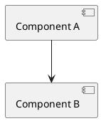

---

**End of Component Diagram Guide**
