# JavaScript/TypeScript to UML Patterns
**Version:** v0.4.0

Guide for extracting UML diagrams from JavaScript and TypeScript source code.

---

## Class Extraction

### TypeScript Class

**TypeScript:**
```typescript
class User {
  public id: number;
  public name: string;
  private email: string;
  protected createdAt: Date;

  constructor(id: number, name: string, email: string) {
    this.id = id;
    this.name = name;
    this.email = email;
    this.createdAt = new Date();
  }

  public getName(): string {
    return this.name;
  }

  private validateEmail(): boolean {
    return this.email.includes('@');
  }
}
```

**PlantUML:**
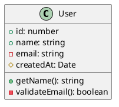

### JavaScript Class (ES6+)

**JavaScript:**
```javascript
class User {
  #password;  // Private field

  constructor(name, email) {
    this.name = name;
    this.email = email;
    this.#password = '';
  }

  getName() {
    return this.name;
  }

  #validatePassword(password) {
    return password.length >= 8;
  }
}
```

**PlantUML:**
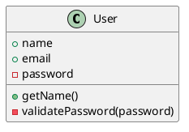

---

## Visibility Mapping

| TypeScript/JavaScript | UML Symbol |
|-----------------------|------------|
| `public` | `+` |
| `private` / `#field` | `-` |
| `protected` | `#` |
| (no modifier) | `+` (default public) |

---

## Type Mappings

### TypeScript to UML

| TypeScript Type | UML Type |
|-----------------|----------|
| `string` | `string` |
| `number` | `number` |
| `boolean` | `boolean` |
| `void` | `void` |
| `any` | `any` |
| `unknown` | `unknown` |
| `null` | `null` |
| `undefined` | `undefined` |
| `never` | `never` |

### Generic Types

| TypeScript Type | UML Type |
|-----------------|----------|
| `Array<T>` / `T[]` | `Array<T>` |
| `Map<K, V>` | `Map<K, V>` |
| `Set<T>` | `Set<T>` |
| `Promise<T>` | `Promise<T>` |
| `T \| null` | `T?` |
| `T \| undefined` | `T?` |

---

## Interfaces

**TypeScript:**
```typescript
interface Serializable {
  serialize(): string;
  deserialize(data: string): void;
}

interface Repository<T> {
  find(id: string): Promise<T | null>;
  save(entity: T): Promise<T>;
  delete(id: string): Promise<void>;
}
```

**PlantUML:**
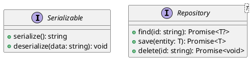

---

## Inheritance and Implementation

### Extends

**TypeScript:**
```typescript
class Animal {
  name: string;

  makeSound(): string {
    return '';
  }
}

class Dog extends Animal {
  breed: string;

  makeSound(): string {
    return 'Bark';
  }
}
```

**PlantUML:**
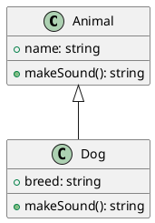

### Implements

**TypeScript:**
```typescript
interface Flyable {
  fly(): void;
}

interface Swimmable {
  swim(): void;
}

class Duck implements Flyable, Swimmable {
  fly(): void {
    // Implementation
  }

  swim(): void {
    // Implementation
  }
}
```

**PlantUML:**
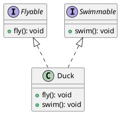

---

## Abstract Classes

**TypeScript:**
```typescript
abstract class Shape {
  abstract area(): number;
  abstract perimeter(): number;

  describe(): string {
    return `Area: ${this.area()}, Perimeter: ${this.perimeter()}`;
  }
}

class Rectangle extends Shape {
  constructor(private width: number, private height: number) {
    super();
  }

  area(): number {
    return this.width * this.height;
  }

  perimeter(): number {
    return 2 * (this.width + this.height);
  }
}
```

**PlantUML:**
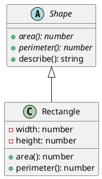

---

## Enums

**TypeScript:**
```typescript
enum OrderStatus {
  Pending = 'pending',
  Confirmed = 'confirmed',
  Shipped = 'shipped',
  Delivered = 'delivered',
  Cancelled = 'cancelled'
}

enum Direction {
  Up,
  Down,
  Left,
  Right
}
```

**PlantUML:**
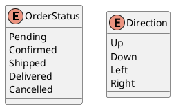

---

## Type Aliases and Union Types

**TypeScript:**
```typescript
type ID = string | number;

type Result<T> = {
  success: boolean;
  data?: T;
  error?: string;
};

type UserRole = 'admin' | 'user' | 'guest';
```

**PlantUML:**
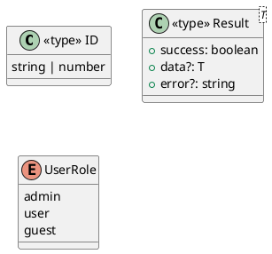

---

## Decorators (Angular, NestJS)

**TypeScript:**
```typescript
@Injectable()
class UserService {
  constructor(
    @Inject('USER_REPOSITORY')
    private readonly userRepository: Repository<User>
  ) {}

  @Cache({ ttl: 300 })
  async findAll(): Promise<User[]> {
    return this.userRepository.findAll();
  }
}

@Controller('users')
class UserController {
  @Get()
  getUsers(): Promise<User[]> {
    // Implementation
  }

  @Post()
  createUser(@Body() dto: CreateUserDto): Promise<User> {
    // Implementation
  }
}
```

**PlantUML:**
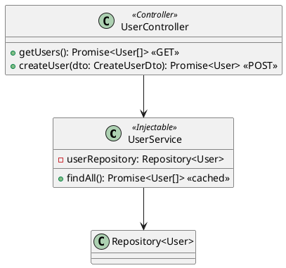

---

## React Components (Functional)

**TypeScript:**
```typescript
interface UserListProps {
  users: User[];
  onSelect: (user: User) => void;
}

const UserList: React.FC<UserListProps> = ({ users, onSelect }) => {
  return (
    <ul>
      {users.map(user => (
        <li key={user.id} onClick={() => onSelect(user)}>
          {user.name}
        </li>
      ))}
    </ul>
  );
};

interface UserFormProps {
  initialData?: User;
  onSubmit: (data: User) => Promise<void>;
}

const UserForm: React.FC<UserFormProps> = ({ initialData, onSubmit }) => {
  // Implementation
};
```

**PlantUML:**
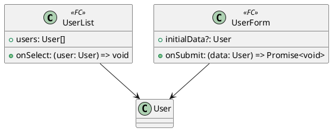

---

## Module/Package Structure

### From Directory

```
src/
├── models/
│   ├── index.ts
│   ├── user.ts      → User, UserProfile
│   └── order.ts     → Order, LineItem
├── services/
│   ├── index.ts
│   ├── user.service.ts
│   └── order.service.ts
└── repositories/
    ├── index.ts
    └── base.repository.ts
```

**PlantUML:**
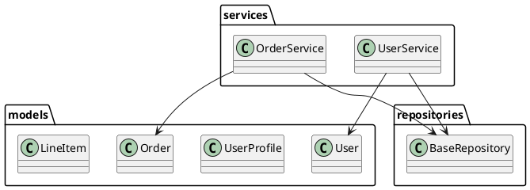

---

## Associations from Properties

### One-to-One

**TypeScript:**
```typescript
class User {
  profile: UserProfile;
}

class UserProfile {
  user: User;
}
```

**PlantUML:**
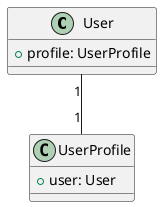

### One-to-Many

**TypeScript:**
```typescript
class Customer {
  orders: Order[];
}

class Order {
  customer: Customer;
}
```

**PlantUML:**
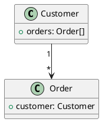

---

## Sequence from Async/Await

**TypeScript:**
```typescript
class OrderController {
  async createOrder(req: Request, res: Response): Promise<void> {
    const user = await this.authService.getCurrentUser(req);
    const order = await this.orderService.create(user, req.body.items);
    await this.notificationService.sendConfirmation(user, order);
    res.json(order);
  }
}
```

**PlantUML:**
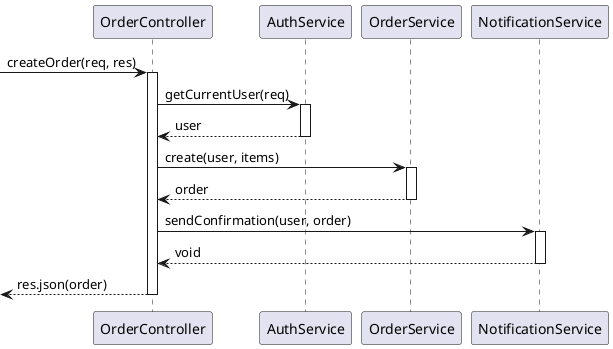

---

## Complete Example

**TypeScript Source:**
```typescript
enum OrderStatus {
  Pending = 'pending',
  Confirmed = 'confirmed',
  Shipped = 'shipped'
}

interface LineItem {
  productId: string;
  quantity: number;
  unitPrice: number;
}

class Order {
  public id?: string;
  public customerId: number;
  public items: LineItem[] = [];
  public status: OrderStatus = OrderStatus.Pending;

  constructor(customerId: number) {
    this.customerId = customerId;
  }

  addItem(item: LineItem): void {
    this.items.push(item);
  }

  get total(): number {
    return this.items.reduce(
      (sum, item) => sum + item.quantity * item.unitPrice,
      0
    );
  }
}

interface OrderRepository {
  save(order: Order): Promise<Order>;
  findById(orderId: string): Promise<Order | null>;
}

class PostgresOrderRepository implements OrderRepository {
  async save(order: Order): Promise<Order> {
    // Implementation
    return order;
  }

  async findById(orderId: string): Promise<Order | null> {
    // Implementation
    return null;
  }
}
```

**PlantUML:**
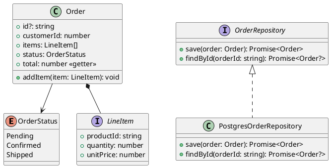

---

## JSDoc to UML (Plain JavaScript)

**JavaScript with JSDoc:**
```javascript
/**
 * @typedef {Object} User
 * @property {number} id
 * @property {string} name
 * @property {string} email
 */

/**
 * @class
 */
class UserService {
  /**
   * @param {number} id
   * @returns {Promise<User|null>}
   */
  async findById(id) {
    // Implementation
  }

  /**
   * @param {User} user
   * @returns {Promise<User>}
   */
  async save(user) {
    // Implementation
  }
}
```

**PlantUML:**
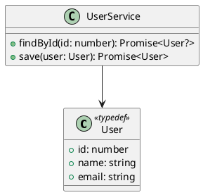

---

**End of JavaScript/TypeScript to UML Patterns**
