# Python to UML Patterns
**Version:** v0.12.0

Guide for extracting UML diagrams from Python source code.

---

## Class Extraction

### Basic Class

**Python:**
```python
class User:
    def __init__(self, name: str, email: str):
        self.name = name
        self.email = email
        self._password: str = ""

    def authenticate(self, password: str) -> bool:
        return self._verify(password)

    def _verify(self, password: str) -> bool:
        # Private method
        pass
```

**PlantUML:**
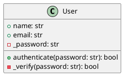

### Visibility Mapping

| Python Convention | UML Symbol |
|-------------------|------------|
| `name` (no prefix) | `+` (public) |
| `_name` (single underscore) | `-` (private by convention) |
| `__name` (double underscore) | `-` (private, name mangled) |

---

## Type Hints to UML Types

### Basic Types

| Python Type | UML Type |
|-------------|----------|
| `str` | `string` |
| `int` | `int` |
| `float` | `float` |
| `bool` | `boolean` |
| `None` | `void` |
| `Any` | `any` |

### Collection Types

| Python Type | UML Type |
|-------------|----------|
| `List[T]` | `List<T>` |
| `Dict[K, V]` | `Map<K, V>` |
| `Set[T]` | `Set<T>` |
| `Tuple[A, B]` | `Tuple<A, B>` |
| `Optional[T]` | `T?` or `T [0..1]` |

### Example

**Python:**
```python
from typing import List, Optional, Dict

class OrderService:
    def get_orders(self, user_id: int) -> List[Order]:
        pass

    def find_order(self, order_id: str) -> Optional[Order]:
        pass

    def get_totals(self) -> Dict[str, float]:
        pass
```

**PlantUML:**
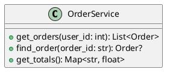

---

## Inheritance

### Single Inheritance

**Python:**
```python
class Animal:
    def make_sound(self) -> str:
        pass

class Dog(Animal):
    def make_sound(self) -> str:
        return "Bark"
```

**PlantUML:**
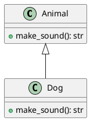

### Multiple Inheritance

**Python:**
```python
class Swimmer:
    def swim(self) -> None:
        pass

class Flyer:
    def fly(self) -> None:
        pass

class Duck(Swimmer, Flyer):
    pass
```

**PlantUML:**
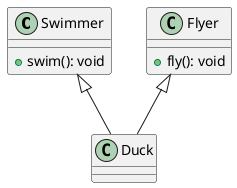

---

## Abstract Classes

**Python:**
```python
from abc import ABC, abstractmethod

class Shape(ABC):
    @abstractmethod
    def area(self) -> float:
        pass

    @abstractmethod
    def perimeter(self) -> float:
        pass

class Rectangle(Shape):
    def __init__(self, width: float, height: float):
        self.width = width
        self.height = height

    def area(self) -> float:
        return self.width * self.height

    def perimeter(self) -> float:
        return 2 * (self.width + self.height)
```

**PlantUML:**
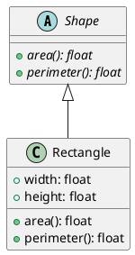

---

## Protocols (Interfaces)

**Python:**
```python
from typing import Protocol

class Serializable(Protocol):
    def serialize(self) -> str:
        ...

    def deserialize(self, data: str) -> None:
        ...

class User:
    def serialize(self) -> str:
        return json.dumps(self.__dict__)

    def deserialize(self, data: str) -> None:
        self.__dict__.update(json.loads(data))
```

**PlantUML:**
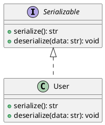

---

## Dataclasses

**Python:**
```python
from dataclasses import dataclass
from typing import List
from datetime import datetime

@dataclass
class Order:
    id: str
    customer_id: int
    items: List[LineItem]
    created_at: datetime
    total: float = 0.0

@dataclass
class LineItem:
    product_id: str
    quantity: int
    unit_price: float
```

**PlantUML:**
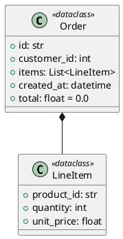

---

## Enums

**Python:**
```python
from enum import Enum, auto

class OrderStatus(Enum):
    PENDING = auto()
    CONFIRMED = "confirmed"
    SHIPPED = "shipped"
    DELIVERED = "delivered"
    CANCELLED = "cancelled"
```

**PlantUML:**
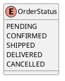

---

## Associations from Type Hints

### One-to-One

**Python:**
```python
class User:
    profile: UserProfile

class UserProfile:
    user: User
```

**PlantUML:**
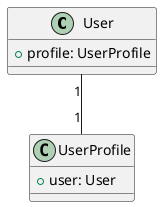

### One-to-Many

**Python:**
```python
class Customer:
    orders: List[Order]

class Order:
    customer: Customer
```

**PlantUML:**
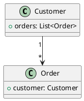

### Composition vs Aggregation

**Composition (strong ownership):**
```python
class House:
    def __init__(self):
        self.rooms: List[Room] = []  # Rooms don't exist without House
```

```plantuml
House *-- Room
```

**Aggregation (weak ownership):**
```python
class Department:
    def __init__(self):
        self.employees: List[Employee] = []  # Employees can exist independently
```

```plantuml
Department o-- Employee
```

---

## Decorators as Stereotypes

**Python:**
```python
from functools import lru_cache

class Calculator:
    @staticmethod
    def add(a: int, b: int) -> int:
        return a + b

    @classmethod
    def create(cls) -> 'Calculator':
        return cls()

    @property
    def name(self) -> str:
        return "Calculator"

    @lru_cache
    def expensive_operation(self, n: int) -> int:
        pass
```

**PlantUML:**
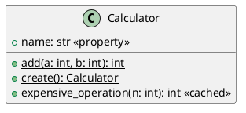

---

## Module/Package Structure

### From Directory

```
src/
├── models/
│   ├── __init__.py
│   ├── user.py      → User, UserProfile
│   └── order.py     → Order, LineItem
├── services/
│   ├── __init__.py
│   ├── user_service.py
│   └── order_service.py
└── repositories/
    ├── __init__.py
    └── base.py
```

**PlantUML:**
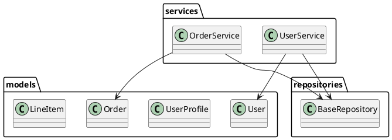

---

## Sequence from Function Calls

**Python:**
```python
class OrderController:
    def create_order(self, request: Request) -> Response:
        user = self.auth_service.get_current_user(request)
        order = self.order_service.create(user, request.items)
        self.notification_service.send_confirmation(user, order)
        return Response(order)
```

**PlantUML:**
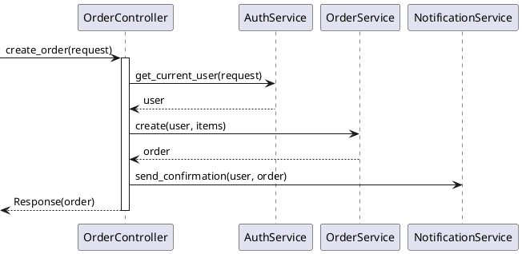

---

## Complete Example

**Python Source:**
```python
from abc import ABC, abstractmethod
from dataclasses import dataclass
from typing import List, Optional
from enum import Enum

class OrderStatus(Enum):
    PENDING = "pending"
    CONFIRMED = "confirmed"
    SHIPPED = "shipped"

@dataclass
class LineItem:
    product_id: str
    quantity: int
    unit_price: float

    @property
    def subtotal(self) -> float:
        return self.quantity * self.unit_price

class Order:
    def __init__(self, customer_id: int):
        self.id: Optional[str] = None
        self.customer_id = customer_id
        self.items: List[LineItem] = []
        self.status = OrderStatus.PENDING

    def add_item(self, item: LineItem) -> None:
        self.items.append(item)

    @property
    def total(self) -> float:
        return sum(item.subtotal for item in self.items)

class OrderRepository(ABC):
    @abstractmethod
    def save(self, order: Order) -> Order:
        pass

    @abstractmethod
    def find_by_id(self, order_id: str) -> Optional[Order]:
        pass

class PostgresOrderRepository(OrderRepository):
    def save(self, order: Order) -> Order:
        # Implementation
        pass

    def find_by_id(self, order_id: str) -> Optional[Order]:
        # Implementation
        pass
```

**PlantUML:**
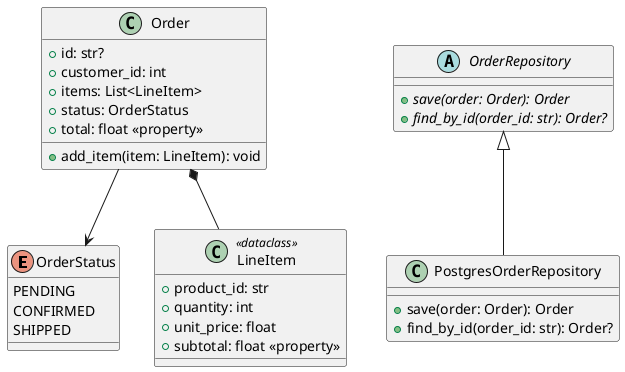

---

**End of Python to UML Patterns**
