# Sequence Diagram Guide
**Version:** v0.14.0

PlantUML syntax reference for generating sequence diagrams from source code.

---

## Basic Sequence

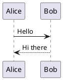

---

## Participants

### Participant Types

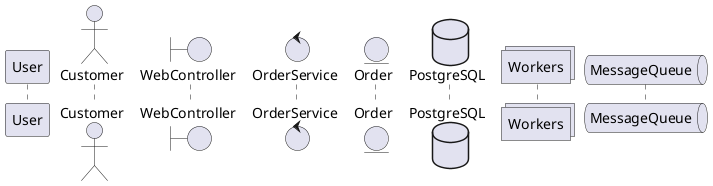

| Type | Use For |
|------|---------|
| `participant` | Generic (default) |
| `actor` | External user/system |
| `boundary` | UI/API boundary |
| `control` | Service/controller logic |
| `entity` | Domain object |
| `database` | Data storage |
| `collections` | Group of objects |
| `queue` | Message queue |

### Participant Aliases

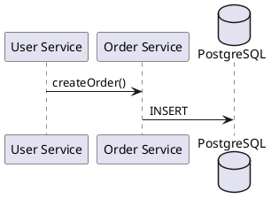

### Participant Order

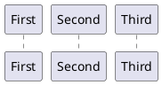

---

## Arrow Types

### Synchronous (Solid)

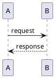

### Asynchronous (Dashed)

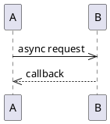

### Lost/Found Messages

```plantuml
@startuml
A ->x B: lost message
A <-? B: found message
@enduml
```

### Self Message

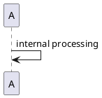

### Arrow Summary

| Arrow | Meaning |
|-------|---------|
| `->` | Sync request |
| `-->` | Sync response |
| `->>` | Async request |
| `-->>` | Async response |
| `-\` | Request (half arrow) |
| `-/` | Request (half arrow) |
| `->x` | Lost message |
| `<-?` | Found message |

---

## Activation (Lifelines)

### Basic Activation

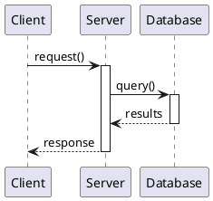

### Shorthand Activation


### Nested Activation

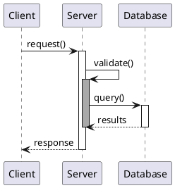

### Return


---

## Grouping

### Alt/Else (Conditionals)

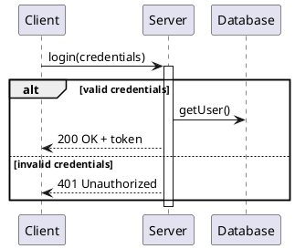

### Opt (Optional)

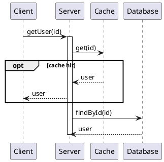

### Loop

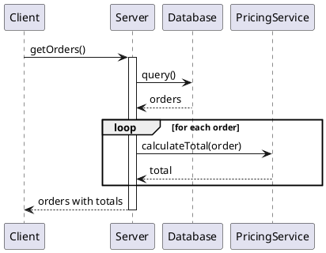

### Break

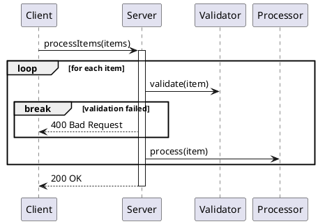

### Par (Parallel)

```plantuml
@startuml
Client -> Server: getDashboard()
activate Server

par
  Server -> UserService: getUser()
and
  Server -> OrderService: getRecentOrders()
and
  Server -> NotificationService: getNotifications()
end

Server --> Client: dashboard data
deactivate Server
@enduml
```

### Critical

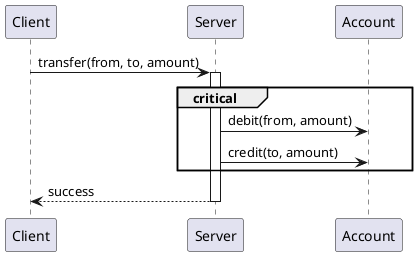

---

## Notes

### Note on Message

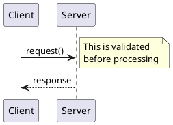

### Note Over Participants

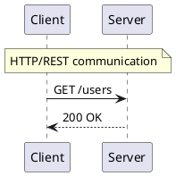

### Note Positions

```plantuml
@startuml
participant A
participant B

note left of A: Left note
note right of B: Right note
note over A: Over A
note over A, B: Spanning note
@enduml
```

---

## Dividers and Delays

### Dividers

```plantuml
@startuml
Client -> Server: login()
Server --> Client: token

== Order Process ==

Client -> Server: createOrder()
Server --> Client: orderId

== Payment ==

Client -> PaymentGateway: pay()
PaymentGateway --> Client: confirmation
@enduml
```

### Delays

```plantuml
@startuml
Client -> Server: longRunningTask()
...5 minutes later...
Server --> Client: completed

Client -> Server: anotherTask()
|||
Server --> Client: done
@enduml
```

---

## Reference (Subsequence)

```plantuml
@startuml
participant Client
participant Server

Client -> Server: login()
ref over Server: Authentication Process
Server --> Client: token

Client -> Server: getOrders()
ref over Server: Order Retrieval
Server --> Client: orders
@enduml
```

---

## Complete Example: REST API Flow

```plantuml
@startuml
title Order Creation Flow

actor Customer
boundary "API Gateway" as API
control "Order Service" as Orders
control "Inventory Service" as Inventory
control "Payment Service" as Payment
database "PostgreSQL" as DB
queue "Message Queue" as MQ

Customer -> API: POST /orders
activate API

API -> Orders: createOrder(items)
activate Orders

Orders -> Inventory: checkAvailability(items)
activate Inventory
Inventory -> DB: SELECT stock
DB --> Inventory: stock levels

alt all items available
  Inventory --> Orders: available = true
else items unavailable
  Inventory --> Orders: available = false
  Orders --> API: 400 Bad Request
  API --> Customer: "Items unavailable"
  deactivate Inventory
  deactivate Orders
  deactivate API
end
deactivate Inventory

Orders -> Payment: processPayment(amount)
activate Payment
Payment --> Orders: paymentId
deactivate Payment

Orders -> DB: INSERT order
DB --> Orders: orderId

Orders ->> MQ: OrderCreated event
note right: Async notification

Orders --> API: 201 Created
deactivate Orders

API --> Customer: order details
deactivate API

== Async Processing ==

MQ ->> Inventory: reserve items
MQ ->> "Notification Service": send confirmation
@enduml
```

---

## Extraction Patterns

### From Source Code

When tracing code execution:

1. **Entry Point**: Identify the starting method/function
2. **Participants**: Classes/services involved in the flow
3. **Messages**: Method calls between participants
4. **Return Values**: Responses/return types
5. **Conditionals**: if/else/switch statements → `alt/else`
6. **Loops**: for/while/foreach → `loop`
7. **Error Handling**: try/catch → `alt/else` or `break`
8. **Async Operations**: Promises, callbacks → dashed arrows

### Focus Areas

For complex codebases, create separate diagrams for:
- Happy path only
- Error scenarios
- Single feature/use case
- API request lifecycle
- Background job processing

---

## Styling

### Title

```plantuml
@startuml
title My Sequence Diagram
header Page Header
footer Page %page% of %lastpage%
@enduml
```

### Autonumber

```plantuml
@startuml
autonumber
A -> B: First
B -> C: Second
C -> A: Third
@enduml
```

### Hide Footbox

```plantuml
@startuml
hide footbox
A -> B: message
@enduml
```

---

**End of Sequence Diagram Guide**
